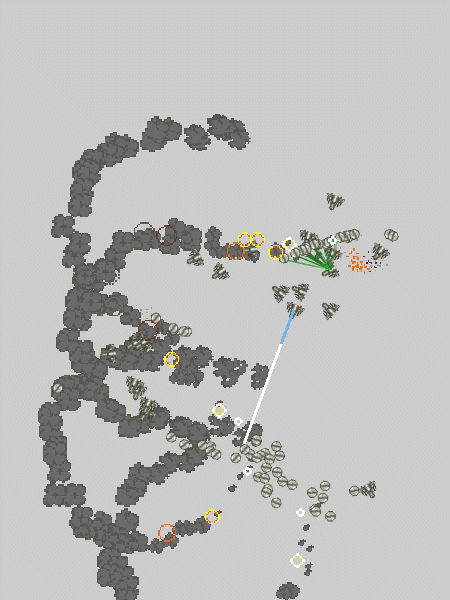

# Bevy Combat

[](https://crates.io/crates/bevy_combat)
[](https://docs.rs/bevy_combat)

It's a bevy port of my [ECS Combat](https://github.com/ElliotB256/ECSCombat/) Unity demo.

Check out the [web demo](https://elliotb256.github.io/bevy_combat/) in your browser.
You can use the - and = keys to speed up and slow down time (make sure you have focussed the browser window).




## Added so far

* Movement
* Combat and targetting AI
* Simple weapons (instant hit), damage, health and mortality
* Death animations and explosions
* Shields

## Coming soon

* More weapons
* Combat calculations, e.g. weapon effectiveness.
* Ship shaders
* Fix bugs

## Getting Started

To build and deploy for web:
```
cargo make serve
```

To run for pc:
```
cargo run
```

## Testing for web

Make sure you have added the wasm target to your toolchain:
```
rustup target add wasm32-unknown-unknown
```

If you do not have `wasm-server-runner`, install it via
```
cargo install wasm-server-runner
```

Afterwards, you can build and run in your browser:
```
cargo run --target wasm32-unknown-unknown
```

For more info on web deployment, see [the bevy book](https://bevy-cheatbook.github.io/platforms/wasm.html).

### Building for itch.io

Following [these instructions](https://bevy-cheatbook.github.io/platforms/wasm/webpage.html)...

itch.io build requires
```
cargo install wasm-bindgen-cli
```

Build the wasm target, then run `wasm-bindgen`:
```
cargo build --release --target wasm32-unknown-unknown
wasm-bindgen --no-typescript --target web --out-dir ./out/ --out-name "game" ./target/wasm32-unknown-unknown/release/bevy_combat.wasm
```
Copy the assets folder to `/out`. Copy `web/index.html` to `/out/index.html`

Zip the `out` folder, upload to itch.io, and celebrate!

## Credits

Credit for individual art assets can be found [here](assets/credits.md).
