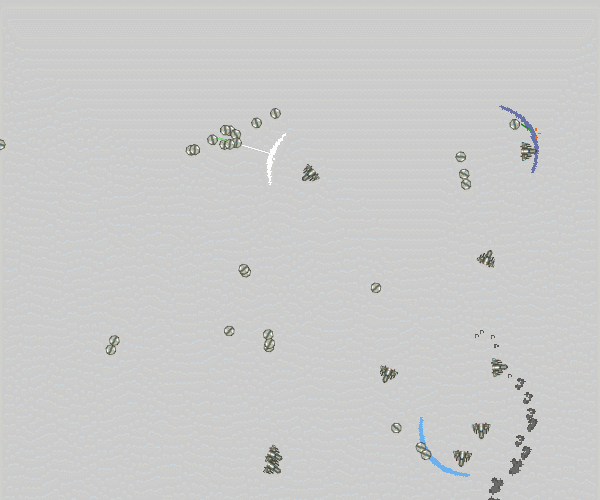

# bevy_combat

It's a bevy port of the [ECS Combat](https://github.com/ElliotB256/ECSCombat/) I wrote in Unity.

You can also try the [web demo](https://elliotb256.github.io/bevy_combat/) in your browser.

## Added so far

* Movement
* AI and targetting
* Simple weapons (instant hit), damage
* Death animations
* Explosions

## Coming soon

* More weapons
* Combat calculations
* Ship shaders
* Fix bugs
